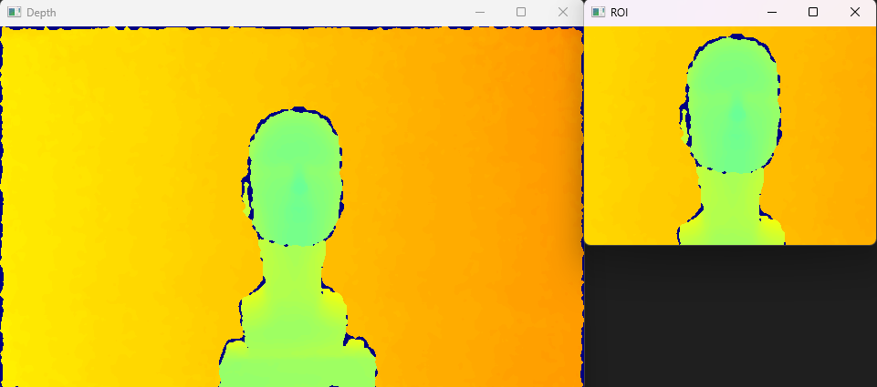

# Region Of Interest (ROI)

## Overview

This example demonstrate how get the depth information with ROI using openCV function.

## Expect Output



## Prerequisite

* [Hello LIPSEdge SDK](../hello-lipsedge-sdk/)
* [OpenCV Viewer](../opencv_viewer/)

## Tutorial

* After getting the depth frame and convert to OpenCV Mat, we can easily set an ROI by using OpenCV Rectangle.

```cpp
cv::Rect roi(160, 80, 320, 240);
```

* Then apply to the depth frame
```cpp
cv::Mat depthMat;
cv::Mat depthMatRoi;
...
depth.readFrame(&depthFrame);
depthMat = cv::Mat(depthFrame.getHeight(), depthFrame.getWidth(), CV_16UC1, (void *)depthFrame.getData());
depthMatRoi = depthMat(roi);
```

* Finally display the two frames
```cpp
cv::imshow("Depth", depthMat);
cv::imshow("ROI", depthMatRoi);
```

## Full code

[roi.cpp](./roi.cpp)